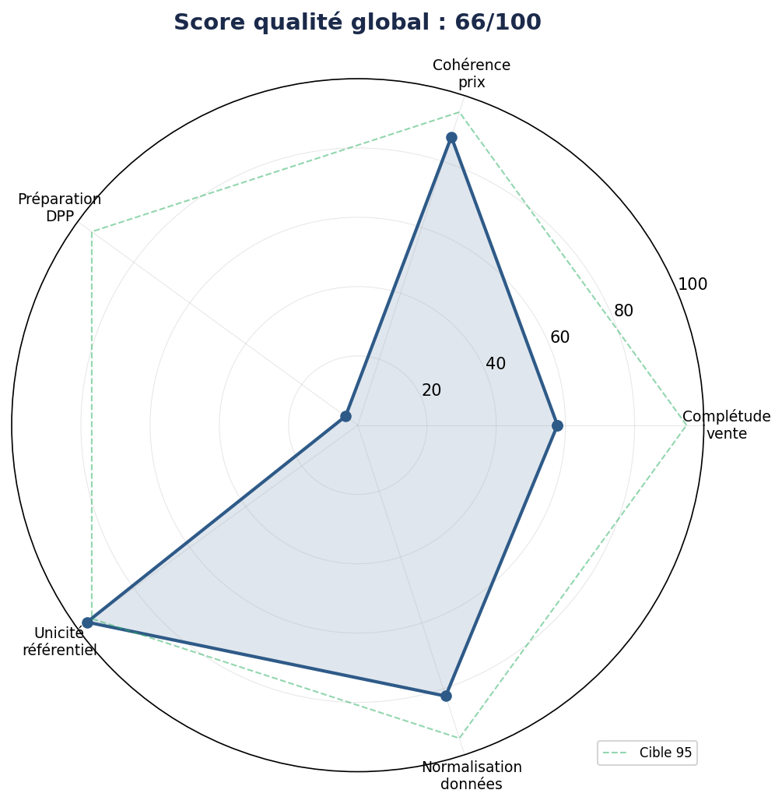
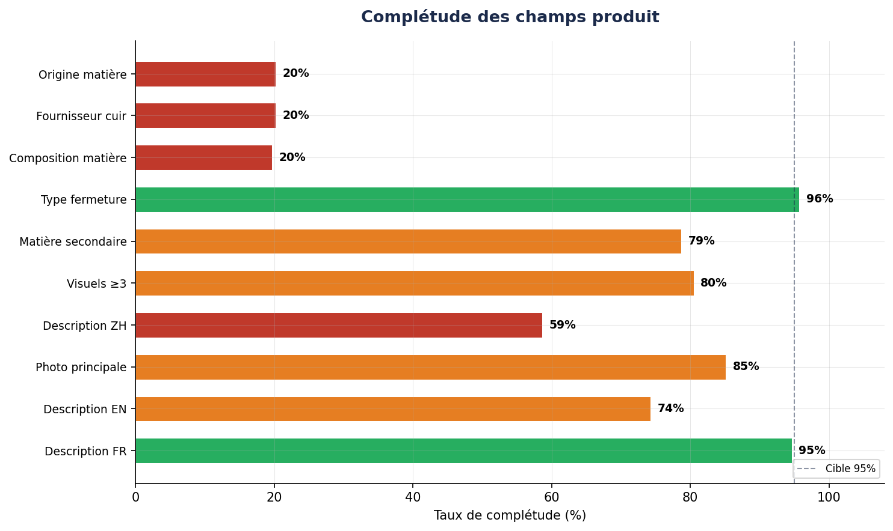
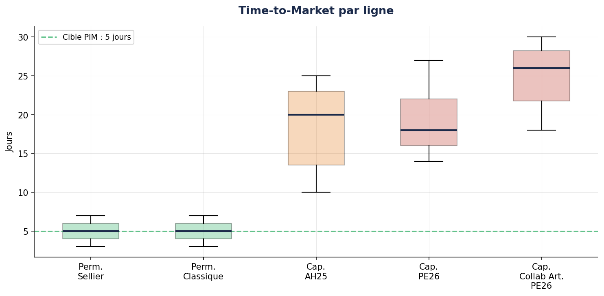
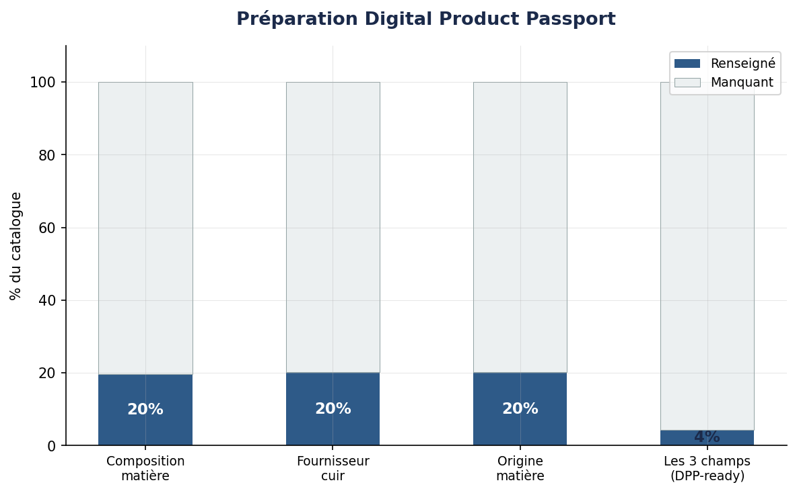

# LuxData Governance

**Simulation de mission conseil PIM/DAM pour une maison de luxe — Gouvernance données produit**

> Projet portfolio simulant une mission de conseil E2E (cadrage → diagnostic → cahier des charges) pour une maison de maroquinerie de luxe fictive. Trois livrables consultant, un dataset synthétique de 1 076 SKUs, et un audit data quality automatisé.

---

## Contexte de la mission

**Client fictif :** Maison Éclat Paris — maroquinerie de luxe, 85M€ de CA, 28 boutiques, ~1 200 SKUs actifs, distribution omnicanale (retail, e-commerce Shopify Plus, wholesale).

**Problématique :** la donnée produit est éclatée dans 4 systèmes non connectés (Excel, Shopify, Cegid, PDF). Conséquences : 42% de fiches incomplètes, un time-to-market capsule de 20 jours (vs 5j cible), 12,5% d'incohérences prix cross-canal, et seulement 4,4% du catalogue conforme au Digital Product Passport (DPP, réglementation UE fin 2028).

**Mission Adone Conseil :** cadrer, diagnostiquer et spécifier la solution PIM/DAM pour centraliser le référentiel produit, éliminer la ressaisie (~2 ETP), et anticiper la conformité DPP.

---

## Livrables

| # | Livrable | Description |
|---|----------|-------------|
| L1 | [Note de cadrage](livrables/L1_note_cadrage.docx) | Fiche client, écosystème SI, problématique, gouvernance projet (RACI, risques, budget 500-800K€), roadmap 3 phases |
| L2 | [Diagnostic data produit](livrables/L2_diagnostic_data_produit.docx) | Audit qualité 5 dimensions, score global 68/100, 5 constats métier chiffrés, causes racines, recommandations |
| L3 | [Cahier des charges PIM/DAM](livrables/L3_cdc_fonctionnel_pim_dam.docx) | Modèle de données cible, 20 user stories MoSCoW, benchmark Akeneo/Salsify/Contentserv, roadmap déploiement, conduite du changement |

## Dataset & code

| Fichier | Description |
|---------|-------------|
| [dataset_maison_eclat.xlsx](data/dataset_maison_eclat.xlsx) | Dataset synthétique : 1 076 SKUs, 33 colonnes, 83 modèles, 7 types de problèmes de qualité injectés |
| [generate_dataset.py](code/generate_dataset.py) | Script de génération du dataset (seed fixé, reproductible) |
| [audit_dataset.py](code/audit_dataset.py) | Script d'audit : calcul des 5 scores, génération des 5 graphiques |

## Résultats clés de l'audit

| Dimension | Score | Constat |
|-----------|-------|---------|
| Complétude vente | 58/100 | 42% des fiches avec ≥1 champ critique manquant |
| Cohérence prix | 87/100 | 12,5% d'écarts prix entre retail et e-commerce |
| Préparation DPP | 4/100 | Seules 47 fiches sur 1 076 sont DPP-ready |
| Unicité référentiel | 97/100 | 35 doublons, 18 variantes de catégorisation |
| Normalisation | 92/100 | 5 formats de poids, 8 formats d'origine matière |
| **Score global** | **68/100** | **Niveau insuffisant — PIM requis** |

## Graphiques

<p align="center">
  
  
</p>
<p align="center">
  
  
</p>

## Stack & compétences

**Métier :** Gouvernance données · PIM/DAM · Référentiel produit · Spécifications fonctionnelles · Benchmark solutions · Digital Product Passport · Conduite du changement · Luxe-Retail omnicanal

**Technique :** Python (pandas, matplotlib, openpyxl) · Méthodologie agile · MoSCoW

---

## Comment reproduire

```bash
pip install pandas openpyxl matplotlib
python code/generate_dataset.py
python code/audit_dataset.py
```

---


